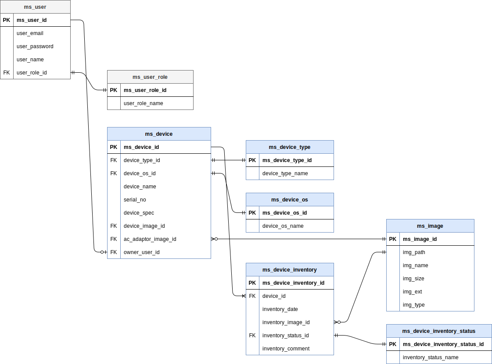

# データベース設計

## 基本方針

- テーブル名には管理システム(ms_)をプレフィックスとしてつける
- ID項目は「テーブル名」+「ID」で固定
- 基本的に論理削除は考えないことにします

## テーブル一覧

| 論理名                         | 物理名                     |
| ------------------------------ | -------------------------- |
| 管理システムユーザ             | ms_user                    |
| 管理システムユーザロール       | ms_user_role               |
| 管理システム端末               | ms_device                  |
| 管理システム端末種別           | ms_device_type             |
| 管理システム端末OS             | ms_device_os               |
| 管理システム端末棚卸           | ms_device_inventory        |
| 管理システム端末棚卸ステータス | ms_device_inventory_status |
| 管理システム画像               | ms_image                   |

## 共通項目
※各テーブルに必ず入れる

| 論理名       | 物理名      | データ型 | NotNull | デフォルト値 | 備考 |
| ------------ | ----------- | -------- | ------- | ------------ | ---- |
| 更新日       | upd_date    | datetime |         |              |      |
| 更新ユーザID | upd_user_id | int(10)  |         |              | FK   |
| 登録日       | reg_date    | datetime |         |              |      |
| 登録ユーザID | reg_user_id | int(10)  |         |              | FK   |

## 管理システムユーザ(ms_user)

| 論理名         | 物理名        | データ型     | NotNull | デフォルト値 | 備考           |
| -------------- | ------------- | ------------ | ------- | ------------ | -------------- |
| ユーザID       | ms_user_id    | int(10)      | ○       |              | AUTO_INCREMENT |
| メールアドレス | user_email    | varchar(255) | ○       |              |                |
| パスワード     | user_password | varchar(100) | ○       |              |                |
| ユーザ名       | user_name     | varchar(100) |         |              |                |
| ユーザロールID | user_role_id  | int(10)      |         |              | FK             |

## 管理システムユーザロール(ms_user_role)

| 論理名         | 物理名          | データ型     | NotNull | デフォルト値 | 備考           |
| -------------- | --------------- | ------------ | ------- | ------------ | -------------- |
| ユーザロールID | ms_user_role_id | int(10)      | ○       |              | AUTO_INCREMENT |
| ロール名       | user_role_name  | varchar(100) | ○       |              |                |

## 管理システム端末(ms_device)

| 論理名           | 物理名              | データ型     | NotNull | デフォルト値 | 備考           |
| ---------------- | ------------------- | ------------ | ------- | ------------ | -------------- |
| 端末ID           | ms_device_id        | int(10)      | ○       |              | AUTO_INCREMENT |
| 端末種別ID       | device_type_id      | int(10)      | ○       |              | FK             |
| OSID             | device_os_id        | int(10)      | ○       |              | FK             |
| 端末名           | device_name         | varchar(100) |         |              |                |
| シリアルNo       | serial_no           | varchar(100) |         |              |                |
| 端末仕様         | device_spec         | text         |         |              |                |
| 端末画像ID       | device_image_id     | int(10)      |         |              |                |
| ACアダプタ画像ID | ac_adaptor_image_id | int(10)      |         |              |                |
| 所有者ID         | owner_user_id       | text         |         |              | FK             |

## 管理システム端末種別(ms_device_type)

| 論理名                 | 物理名            | データ型     | NotNull | デフォルト値 | 備考           |
| ---------------------- | ----------------- | ------------ | ------- | ------------ | -------------- |
| 管理システム端末種別ID | ms_device_type_id | int(10)      | ○       |              | AUTO_INCREMENT |
| 端末種別名             | device_type_name  | varchar(100) | ○       |              |                |

## 管理システム端末OS(ms_device_os)

| 論理名           | 物理名          | データ型     | NotNull | デフォルト値 | 備考           |
| ---------------- | --------------- | ------------ | ------- | ------------ | -------------- |
| 管理システムosID | ms_device_os_id | int(10)      | ○       |              | AUTO_INCREMENT |
| 端末OS名         | device_os_name  | varchar(100) | ○       |              |                |

## 管理システム端末棚卸(ms_device_inventory)

| 論理名                 | 物理名                 | データ型 | NotNull | デフォルト値 | 備考           |
| ---------------------- | ---------------------- | -------- | ------- | ------------ | -------------- |
| 管理システム端末棚卸ID | ms_device_inventory_id | int(10)  | ○       |              | AUTO_INCREMENT |
| 端末ID                 | device_id              | int(10)  | ○       |              | FK             |
| 棚卸日                 | inventory_date         | datetime | ○       |              |                |
| 棚卸画像ID             | inventory_image_id     | int(10)  |         |              |                |
| 棚卸ステータスID       | inventory_status_id    | int(10)  | ○       |              | FK             |
| 棚卸コメント           | inventory_comment      | text     |         |              |                |

## 管理システム端末棚卸ステータス(ms_device_inventory_status)

| 論理名                           | 物理名                        | データ型     | NotNull | デフォルト値 | 備考           |
| -------------------------------- | ----------------------------- | ------------ | ------- | ------------ | -------------- |
| 管理システム端末棚卸ステータスID | ms_device_inventory_status_id | int(10)      | ○       |              | AUTO_INCREMENT |
| 棚卸ステータス名                 | inventory_status_name         | varchar(100) | ○       |              |                |

## 管理システム画像(ms_image)

| 論理名             | 物理名      | データ型     | NotNull | デフォルト値 | 備考           |
| ------------------ | ----------- | ------------ | ------- | ------------ | -------------- |
| 管理システム画像ID | ms_image_id | int(10)      | ○       |              | AUTO_INCREMENT |
| 画像パス           | img_path    | varchar(255) | ○       |              |                |
| 画像名             | img_name    | varchar(255) |         |              |                |
| 画像サイズ         | img_size    | int(10)      |         |              |                |
| 画像拡張子         | img_ext     | varchar(255) |         |              |                |
| 画像タイプ         | img_type    | varchar(255) |         |              |                |

